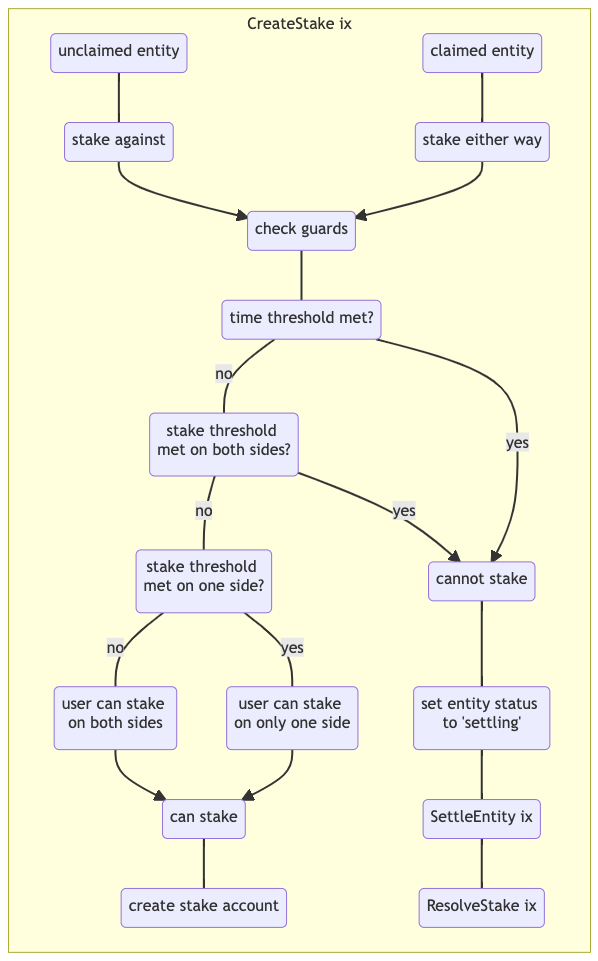

# ILOCKsupreme flow & mermaid code below:

ix === instruction

## 1, CreateUser ix


## 2, CreateStake ix



## 3, ResolveStake ix


## 4, CloseStake ix


## Mermaid code

```
flowchart TD

subgraph SECURITY STAKING


create(CreateUser ix) --- fill
fill(FillUser ix) --- URLbrowse(find URL browsing)
fill --- URLlist(find URL on entity list)
fill --- URLgraelist(find URL on GrAE list)
URLbrowse --- isURL1(what is URL?)
URLlist --- isURL2(what is URL?)
URLgraelist --- isURL3(what is URL?)
isURL1 --- URLsettled(settled)
isURL1 --- URLentity(entity)
isURL1 --- URLgrae(GrAE)
isURL2 --- URLentity(entity)
isURL3 --- URLgrae(GrAE)

URLentity --- isclaimed(is entity claimed?)
ishunter --- |yes|claim(ClaimEntity ix)
claim --> createstake
isclaimed --> |no|ishunter(is user bounty hunter?)


URLsettled --- createentity(CreateEntity ix)
createentity --> ishunter

URLgrae --> createstake(CreateStake ix)
isclaimed --> |yes|createstake

ishunter --> |no|createstake

end


subgraph CreateStake ix

unclaimed(unclaimed entity) --- stakeagainst(stake against)
claimed(claimed entity) --- stakeeither(stake either way)
stakeagainst --> checkguards(check guards)
stakeeither --> checkguards(check guards)

checkguards --- timemet(time threshold met?)
timemet --- |no|totalstakemet(stake threshold <br>met on both sides?)
timemet --> |yes|nostake(cannot stake)
totalstakemet --- |no|halfstakemet(stake threshold <br>met on one side?)
totalstakemet --> |yes|nostake

halfstakemet --- |no|bothsides(user can stake <br> on both sides)
halfstakemet --- |yes|onesideonly(user can stake <br>on only one side)
onesideonly --> stake(can stake)
bothsides --> stake

stake --- stakeaccount(create stake account)
nostake --- setsettling(set entity status <br>to 'settling')
setsettling --- settleentity(SettleEntity ix)
settleentity --- resolvestake(ResolveStake ix)


end


subgraph ResolveStake ix

issettled(is entity settled?) --- |no| jury

subgraph SettleEntity ix

jury(majority bounty hunter jury<br>determines entity status) --- setsettled(set entity status<br>to 'settled')

end

issettled --> |yes|stakecorrect
setsettled --> stakecorrect(was stake correct?)
stakecorrect --- |no|slash(slash stake and<br>return amount to<br>reward pool)
stakecorrect --- |yes|payreward(pay reward from <br>reward pool)
payreward --> success(increment<br>success)
success --- aboveaccuracy(user rise above <br>accuracy threshold?)
aboveaccuracy --- sethunter1(SetHunter ix<br> true)
success --- computetime


belowaccuracy --- sethunter2(SetHunter ix<br> false)
fail --- belowaccuracy(user fallbelow <br>accuracy threshold?)
fail --- computetime


slash --> fail(increment<br>fail)

computetime(compute<br>stake time) --- payyield(pay yield)
payyield --- setresolved(set stake status<br>to 'resolved')

setresolved --- closestake(CloseStake ix)

end

subgraph CloseStake ix

isresolved(is stake resolved?) --- |yes| isbh(is user<br>bounty hunter)
isresolved --- |no|waitforsettlement(wait for settlement)
isbh --> |no|closeaccount(close stake<br>account)
isbh --- |yes|isaccurate(was claim accurate?)
isaccurate --- |no|punish(punishment was <br>lost stake fromk <br>ResolveStake ix)
isaccurate ---|yes|reward(reward bounty hunter)

punish --> closeaccount
reward --> closeaccount

closeaccount --- nostakes(are there more stakes<br>associated with<br> this entity?)
nostakes --- |no|closeentity(CloseEntity ix)

end
```
